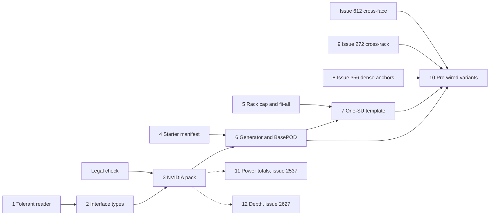

# Spike #3287: pattern analysis

Pattern-analysis pass for [3287-spike.md](3287-spike.md), built on [3287-codebase.md](3287-codebase.md), [3287-external.md](3287-external.md) and [3287-scale.md](3287-scale.md). Code references are on `spike/3287-research` at `466c49a1`. "Derived" marks arithmetic from cited inputs. Issue states were read on 2026-09-13.

Issue-state changes since the spike brief:

- #3108 closed on 2026-09-14 UTC via PR #3280, after this branch point. Writers now stamp `SCHEMA_VERSION` on main. PR #3280 made no reader change, and the gate still reads the MAJOR only, so the tolerant-reader gap stands. PR #3280 also means the next release must add a corpus fixture.
- #1283 is closed. It covered NetBox import workflow input hardening, not interface fidelity, so it is not an extension target.

## Key insights

- The brand pack is the foundation and the only shape with no schema change of its own.
  - DGX bodies, power and weight need no schema change.
  - SN2201 and SN4600C port inventories fit today's enum, apart from console ports, which Rackula does not model.
  - Pack data sits outside the corpus gate's schema paths (`scripts/check-corpus-freshness.sh:12-18`), so it needs no fixture.
  - Templates that reuse pack slugs list under the NVIDIA palette section instead of Generic.
- Fidelity constrains the shapes more than code does.
  - NVIDIA publishes elevations only for SuperPOD B200: Figures 3.1 and 3.2, without U positions. It publishes none for BasePOD.
  - A one-rack BasePOD at B200 density contradicts NVIDIA guidance.
  - The only faithful single racks are RA building blocks, such as a 2 x DGX B200 compute rack at 28.6 kW, so single-rack starters serve neither driver.
- "Unwired" does not mean port-free.
  - Ports are created only on placement or duplication (`src/lib/stores/layout/device-actions.ts:124`, `:437`, `src/lib/stores/layout/recorded-device-actions.ts:173`), never on load. A template device without `PlacedPort` records can never be wired.
  - C and D therefore share one authoring cost. Connections are only about 51 KB of the 343 KB one-SU file (su1 against su1-bare).
  - Generate both from one declarative spec; hand-authoring is not viable at this size.
- Pre-wired fabric is a rendering problem, not a data problem. The switch side is where it fails.
  - At the fixed 8 px port pitch (`src/lib/utils/port-geometry.ts:22`), 64 per-link anchors need 512 px in one row. A 19-inch rack is 220 px wide and a 1U face is 22 px tall (`src/lib/constants/layout.ts:24`, `:36`).
  - 32 cage anchors in two rows of 16 need about 128 x 16 px, which fits (derived).
  - Model per link, draw per cage (#356).
- The forward-compatibility break is the long pole, not the enum edit.
  - A tolerant reader must ship at least one release before any file uses OSFP or InfiniBand values.
  - It is independent of NVIDIA and also protects #368, the power interface types.
  - The next release already owes a corpus fixture because of PR #3280, so landing the reader there adds no gate cost.
- Scale splits cleanly by layout size.
  - BasePOD, at 6 racks or fewer, needs no canvas change.
  - One SU at RA density, about 20 racks, needs a higher rack cap and a lower fit-all floor.
  - 4 SU is a canvas-model problem as much as a performance one. 69 dual-view racks in one row are about 34k px wide (derived: 69 x 488 px), so fit-all would need about 5% zoom, where a U is about 1 px.
- Layout snapshots make packs cheap to maintain but slow to propagate.
  - Placing a device copies its type into `layout.device_types` (`src/lib/stores/layout/recorded-device-actions.ts:47-59`), and layout types resolve before pack types (`src/lib/utils/device-lookup.ts:22-45`).
  - A revised DGX entry therefore reaches new layouts only, and removing an entry never breaks a saved layout.
  - Ship each DGX entry with its full port inventory once. Adding ports later leaves early layouts without them.
- The riskiest line in the pack is its icon.
  - simple-icons ships `siNvidia`, but NVIDIA's brand guidelines bar use of its logo and visual style without written permission.
  - Keep the Zap fallback (`src/lib/components/BrandIcon.svelte:92-96`), and use category colours rather than NVIDIA green. The scale generator used `#76B900`.
  - Hold the release until the Canadian legal check is done.

## Options

### A. Vendor brand pack

What ships:

- `src/lib/data/brandPacks/nvidia.ts`, one `BRAND_PACK_REGISTRY` entry, and a trademark and non-affiliation notice in `ACKNOWLEDGEMENTS.md`, which has no trademark notice today.
- Eight hand-authored device types. NetBox has no DGX file, and the script importer ignores interfaces, so importing would save nothing.

| Device | U | Category | Ports, per link | Fits today's enum |
| --- | --- | --- | --- | --- |
| DGX B200 | 10 | server | 8 x `infiniband-ndr-4x`, 4 x `400gbase-x-qsfp112`, 1 x `10gbase-t`, 1 x BMC `1000base-t` | No |
| DGX H200, DGX H100 | 8 | server | As DGX B200 | No |
| QM9700 | 1 | network | 64 x `infiniband-ndr-4x`, 1 x management `1000base-t` | No |
| SN5600 | 2 | network | 64 x `800gbase-x-osfp`, 1 x `25gbase-x-sfp28` | No |
| SN4600C | 2 | network | 64 x `100gbase-x-qsfp28`, 1 x management `1000base-t` | Yes |
| SN2201 | 1 | network | 48 x `1000base-t`, 4 x `100gbase-x-qsfp28`, 1 x management `1000base-t` | Yes |
| UFM Enterprise Appliance (NDR) | 1 | server | None; the inventory is not published | Not applicable |

- Other fields:
  - `manufacturer: NVIDIA` and a plain model name.
  - `part_number` set to the RA SKU, which fixes the airflow direction.
  - `is_full_depth: true`, with the millimetre depth in `notes` until #2627.
  - `weight` in kg.
  - One `power_ports[]` entry per PSU, with the NetBox inlet string as `type`. The field is a free string (`src/lib/schemas/index.ts:334`).
  - `links` to the NVIDIA source.
- A DGX has 14 rear ports, under the 24-port threshold, so its side of every link is addressable today.

Schema changes:

- None for bodies, power, weight or the two Ethernet switches.
- DGX, QM9700 and SN5600 ports need `infiniband-ndr-4x`, `400gbase-x-qsfp112` and `800gbase-x-osfp`. Those values need a tolerant reader in an earlier release.
- No new category is needed: a DGX is `server`.

UI changes: none beyond the registry entry. Add no `BrandIcon` map entry.

Maintenance cost:

- Low, owned by the maintainers.
- Chassis specs rarely change after launch. New generations, such as B300 and Rubin, arrive as new entries, not edits.
- Snapshots contain the blast radius. Edits reach only new placements, and removals never break a saved layout.
- RA revisions do not touch the pack.

Upgrade corpus:

- The pack data itself needs no fixture.
- The new interface values change `src/lib/schemas`, so they need a fixture that uses each value (issue 2).
- The tolerant reader also needs a fixture, but the next release already owes one.

Blockers:

- The Canadian trademark check.
- The tolerant reader, released before the interface values.
- No open issue blocks it.

Fidelity risks:

- Power: summing PSU ratings (6 x 3.3 kW = 19.8 kW) overstates the DGX B200's 14.3 kW maximum by 38% (derived).
  - Set each PSU's `maximum_draw` to the system maximum divided by the PSU count.
  - Put the rating and redundancy (5+1 or 4+2) in notes.
- Only QM9700 has a published maximum power. For SN4600C, SN5600 and SN2201, leave `maximum_draw` empty and note the typical figure rather than recording it as a maximum.
- Airflow depends on the SKU (P2C or C2P). Pin the RA part number; P2C is `rear-to-front` in NetBox terms. DGX B200 airflow is unpublished, so leave it unset.
- Stand-in port types would misstate the hardware; the scale check used `400gbase-x-qsfpdd` for NDR. Ship real types or none.
- Leave out the unresolved source conflicts:
  - the SN4600 cage type;
  - the QM9790 management ports;
  - the SN2201 console connector;
  - the cage type of the DGX slot-3 100GbE ports.
- DGX H100 is end of sale (secondary source) but still in both RAs. Say so in notes.

### B. Single-rack starters

What ships: 1 to 3 small YAML files in `static/templates/`. The strongest candidates are:

- "SuperPOD B200 compute rack": 2 x DGX B200 and 3 PDUs at 28.6 kW, the Figure 3.1 building block.
- "DGX H200 4-node rack": 4 x 8U at 40.8 kW, which the H100 RA allows.

Schema changes: none of its own. It inherits A's interface-type dependency if it embeds pack types with ports.

UI changes:

- A separate menu group, so these do not sit among the homelab starters.
- Palette entries, which are hard-coded per starter today (`src/lib/actions/registry.ts:490-515`, `src/lib/actions/dispatch.ts:201-206`).

Maintenance cost: low. Each file embeds copies of pack types that must track the pack.

Upgrade corpus:

- None. `static/templates/` is outside the gate.
- `src/tests/starter-templates.test.ts:117-137` parses every shipped file, which catches the internal-units trap.

Blockers: none technical beyond A.

Fidelity risks, which are the reason not to ship B:

- No RA contains a one-rack BasePOD, and BasePOD RA V5 has no elevations.
- B200 at 4 per rack (57.2 kW, 52U) is for specialised sites only. Four B200 take 40U, so a 48U rack cannot also hold the switches.
- H100 or H200 at 4 per rack is allowed. A whole BasePOD in that rack would also need:
  - 7 to 8U of switches;
  - five control-plane nodes;
  - PDUs.

  That is roughly 44 to 50U and over 45 kW (derived, `3287-external.md` section 3), and no NVIDIA figure backs it.

- The faithful single racks are building blocks, not PODs. They show nothing a user cannot build from the pack in a minute.

### C. Multi-rack POD templates (unwired)

What ships:

- A generator script, promoted from `docs/research/3287-scale-gen.mjs`, that emits templates from a declarative spec.
- The spec controls internal-unit positions, embedded pack types, and deterministic `PlacedPort` ids.
- Three templates in a "Data centre" menu group. All racks are 19-inch, 52U and 1,200 mm deep, matching NVIDIA's recommended 700 x 1,200 mm x 52U cabinet.

| Template | Racks | Basis |
| --- | --- | --- |
| DGX B200 BasePOD, 4-node | 3 to 4: 2 compute, 1 to 2 network and control | BasePOD RA V5 Table 4.2 counts, at SuperPOD B200 density (2 per rack) |
| DGX B200 BasePOD, 8-node | 5 to 6: 4 compute, 1 to 2 network and control | Same |
| DGX SuperPOD B200, one SU | About 20: 16 compute plus management | SuperPOD B200 RA Figures 3.1 and 3.2, Table 4.1 |

- Partner gear uses unbranded role types, such as "x86 control-plane node" and "Partner storage appliance".
- PDUs use the generic rack-mounted `2u-pdu`. The B200 figure draws PDUs inside the rack, and the B300 RA specifies 2U PDUs, so the lack of 0U devices does not block this.

Schema changes:

- None of its own.
- Group metadata cannot round-trip, because unknown group fields are not written back. Group `name` carries the SU and row labels instead.
- Rack `notes` carry the RA citation and design load. The field holds up to 1,000 characters (`src/lib/schemas/index.ts:679`).

UI changes:

- Any POD template needs a lazy, grouped manifest with generated palette commands. Every starter is fetched on the first menu open, and even BasePOD files are tens of times larger than a homelab starter: 94 to 118 KB in the scale check, against about 2 KB.
- One SU also needs a rack cap above 20 and a fit-all floor below 25%.
- Present compute rows as bayed groups:
  - A bayed group is 32 px plus 220 px per 19-inch bay (`src/lib/utils/canvas.ts:342-355`).
  - A row group spends about 488 px per dual-view rack (`src/lib/utils/canvas.ts:317-324` plus `RACK_GAP`).
  - Bayed rows take one SU from about 9.8k px to about 4.5k px wide, which frames at about 35% zoom (derived, not measured).
  - Bayed groups also match physical suites. They need equal rack heights.

Maintenance cost:

- Medium, owned by the maintainers.
- The trigger is a new RA version on docs.nvidia.com. SuperPOD B200 is at V08 and BasePOD at V5.
- With the generator, an RA revision is a spec edit plus a regeneration. Without it, the same revision means hand-editing about 350 KB of YAML.
- Record the RA number and version in template notes so staleness is visible.
- A CI check keeps the embedded types equal to the pack.

Upgrade corpus:

- None. Templates are current-format inputs outside the gate.
- Layouts saved from them carry the new interface values, which issue 2's fixture covers.
- Layouts with more than 10 racks already load in every release, because `MAX_RACKS` gates only the add paths.

Blockers:

- The pack (A).
- Issue 4, the lazy grouped manifest.
- Issue 5, the rack cap and fit-all floor. Only the one-SU template needs it.
- No open issue covers the rack cap, the zoom floor or culling. Searches for all three found nothing.

Fidelity risks:

- The BasePOD elevations are Rackula's own, and the templates must say so.
- SuperPOD Figure 3.2 labels devices across rack pairs, gives no U positions, and is drawn for 4 SU. A one-SU management layout is therefore a derivation.
- Node count:
  - Table 4.1 gives 31 DGX plus a UFM, because the UFM displaces one node.
  - Table 3.1 idealises 32.
  - Use 31 and say so.
- The scale check put an SN2201 in every rack. The RA puts the OOB leaves in management rack 5.
- Rack power totals appear only in notes, because nothing sums power (#2537).
- Share links drop every port, because the share schema has none (`src/lib/schemas/share.ts`).

### D. Pre-wired fabric templates

What ships: connection lists on C's templates, from the same generator. All counts are derived (`3287-external.md` section 7):

- BasePOD: 99 links at 4 nodes and 173 at 8, excluding storage. DGX compute ports alternate across the two QM9700 switches.
- One SU: about 700 to 750 links.
  - Compute is rail-optimised: DGX port N connects to leaf N.
  - Leaf-to-spine, in-band and OOB links make up the rest.
- 4 SU: about 2,800 to 3,000 links. Not now.

Schema changes:

- None of its own. The connection model already exists, with v26.7.0 corpus fixtures.
- One connection per port means a twin-port cable is two connections.

UI changes, all in connectivity rendering:

- #356: anchors on devices with more than 24 ports per face.
- #272: cross-rack drawing.
- #612: cross-face drawing. BasePOD needs it where the switch port face and the DGX rear I/O land on different faces.
- Export draws no connections: there is no "connection" match under `src/lib/utils/export`.

Maintenance cost:

- The highest of the four.
- Rail maps and port names come from RA tables, so renaming a pack interface ripples into every template connection. The generator contains that ripple.
- Cross-rack rendering is new surface to maintain.

Upgrade corpus: none beyond issue 2. If #356 or #272 adds schema fields, that issue brings its own fixture.

Blockers:

- #356 and #272 (M009), and #612 (M006).
- Performance: every rack face iterates every connection, about 225,000 iterations per recompute at 4 SU. Render cost is untested, because nothing draws yet.

Fidelity risks:

- Links are not cables:
  - Twin-port transceivers and 2x400G DACs carry two links each.
  - BasePOD Table 4.2 lists 32 fibres against 64 links.
  - Notes must say that connection counts are links, not a bill of materials.
- Storage wiring is partner-defined. Leave it unwired, or end it on an ExternalEndpoint (#1946).
- A partly wired template implies completeness. State which fabrics are wired.

## Comparison

| Criterion | A: brand pack | B: single-rack starters | C: multi-rack POD templates | D: pre-wired fabric |
| --- | --- | --- | --- | --- |
| Enterprise planning | High: real U, power, weight | Low: one rack is not a POD | High: whole-POD composition and rack count | Highest, once links draw |
| Showcase | Low | Low | High | High, but invisible today (0 of 2,887 drawn) |
| What ships | 8 device types | 1 to 3 small YAML files | Generator plus 3 YAML files | Connection lists on C (99 to about 750 links) |
| Schema change | Tolerant reader, then 4 new interface values (the pack uses 3) | None of its own | None of its own | None of its own |
| UI change | Registry entry only | Menu group, palette entries | Lazy grouped manifest; rack cap and fit-all floor for one SU | #356, #272, #612 |
| Maintenance | Low, append-only | Low | Medium: RA revisions become spec edits | High: rail maps and port names ripple |
| Corpus fixture | Yes, for the new values | No | No | No |
| Fidelity risk | Low if sourced | High | Medium, caveated in notes | Medium: links against cables |
| Renders fully today | Yes | Yes | Yes, up to one SU | No |
| Size | Medium | Small | Large | Medium, plus two large M009 issues |
| Verdict | Ship first | Do not ship separately | Ship second | Ship last |

## Recommendation

Ship a combination: A, then C, then D.

- A delivers enterprise planning.
- C delivers the showcase and whole-POD composition.
- D completes both, once connectivity rendering can draw a fabric.
- Drop B as a separate shape. Its only faithful form, the compute-rack building block, lives inside C.

Phases (issue numbers refer to the list below):

| Phase | Issues | Depends on | Release rule | Delivers |
| --- | --- | --- | --- | --- |
| 1. Tolerant reader | 1 | Nothing | Release N; ideally the next release, which already owes a corpus fixture | Forward compatibility for every enum widening, including #368 |
| 2. Library | 2, then 3 | Phase 1 released; legal check | Release N+1 or later | Enterprise planning with real DGX and fabric devices |
| 3. POD templates, unwired | 4 and 5 (can start any time), 6, then 7 | Issue 3; issue 4 for all templates; issue 5 for one SU | None | Showcase and whole-POD composition |
| 4. Pre-wired fabric | 8 (#356), 9 (#272), #612, then 10 | Phase 3 | None | Cabling at POD scale |
| Parallel | 11 (#2537), 12 (#2627) | Pack data populates them | None | Power and depth checks |

Decisions to confirm:

- Rack cap: 24. This fits one SU at RA density (20 racks) plus storage, and stays below the 39-rack size where the scale check measured zoom jank.
- InfiniBand typing: `infiniband-ndr-4x` on both ends of every compute link. This departs from devicetype-library, which types QM9700 as `400gbase-x-osfp`, but it keeps validation from warning on every DGX link.
- Pack timing. The recommendation is to hold the pack for Phase 2 so the DGX entries ship with full ports. The alternative is to ship bodies earlier and accept port-less DGX types in early layouts.
- One-SU node count: 31 DGX plus a UFM, per Table 4.1.

Not now:

- A 4-SU template. It needs culling of off-screen racks and a hierarchical or 2D canvas (SU, row, hall). File both in Backlog when 4 SU becomes a priority.
- Single-rack NVIDIA starters in the homelab menu.
- DGX B300, Rubin NVL8, QM9790, SN4600 and SN5610.
- A gpu or accelerator category.
- 0U PDUs.
- Rack-group metadata or nesting.
- Console ports (#271).
- Schematic SVG front and rear panels. Revisit under #1541 after the pack ships; product photos stay out.
- NetBox importer fidelity:
  - The script importer ignores interfaces.
  - The in-app importer classes any device with a `*base*` interface as network.
  - #1283 did not cover this, so file it separately if needed.
- #3117, container-child ports. It is off the path, because no POD device mounts in a carrier.
- Upstreaming DGX types to devicetype-library, which is #795 context.

If only one phase ships, keep the pack (Phase 2) and its prerequisite (Phase 1).

- The pack serves the planning driver on its own, costs the least to maintain, and every later phase reuses its slugs.
- If the tolerant reader cannot land first, ship the pack with bodies, power and today's port types only. With no later phase to add ports, the snapshot drift in the key insights does not arise.

## Proposed follow-up issues

### 1. feat: tolerant reader for unknown interface and port types

Milestone: M005 -- Connectivity Core. Size: medium. Depends on: none, since #3108 is closed via PR #3280.

`InterfaceTypeSchema` is a strict `z.enum` (`src/lib/schemas/index.ts:136-192`). Every release therefore rejects a whole layout that contains one unknown interface type. That contradicts the same-MAJOR tolerant-reader promise in `docs/reference/SCHEMA.md`. Scope:

- On read, accept any non-empty string for the interface template and placed port `type`.
- Treat unknown values as generic network ports.
- Write them back unchanged.
- Keep offering only known values in the UI.

This must ship at least one release before any layout uses a new value. It also protects later widenings such as #368. No open issue covers it.

Acceptance criteria:

- [ ] A layout with an unknown interface type loads through both the file door and the browser-storage door, with no validation error.
- [ ] Save and reload preserve the unknown string exactly. Nothing coerces it to `other`.
- [ ] Unknown types render as network-category ports, and the tooltip shows the raw string.
- [ ] The in-app NetBox importer keeps unknown type strings, with its existing warning, instead of mapping them to `other`.
- [ ] `static/schemas/rackula-layout.schema.json` is regenerated, and the release carries the corpus fixture the gate requires.

### 2. feat: OSFP, QSFP112, 800G and InfiniBand NDR interface types

Milestone: M005 -- Connectivity Core. Size: small. Depends on: issue 1, shipped in an earlier release.

Add the NetBox strings that DGX-class hardware needs:

- `400gbase-x-osfp`;
- `400gbase-x-qsfp112`;
- `800gbase-x-osfp`;
- `infiniband-ndr-4x`, which exists only in NetBox v4.6.9 and later.

The pack uses three of these. `400gbase-x-osfp` is included so the devicetype-library QM9700 file imports with its real type. Record the convention that InfiniBand fabric ports use `infiniband-ndr-4x` on both ends. Bump the `SCHEMA_VERSION` MINOR, per the enum-widening rule. Leave `infiniband-xdr-4x` and the 1.6T types until B300 or later hardware needs them.

Acceptance criteria:

- [ ] `InterfaceTypeSchema` (`src/lib/schemas/index.ts:136`) and the `InterfaceType` union (`src/lib/types/index.ts:130`) both carry the four values, and a type-level check fails the build if they diverge.
- [ ] The generated JSON Schema is updated and the drift guard passes.
- [ ] A new corpus fixture uses each new value, with every rack-level device at position 6 or above.
- [ ] Tooltip labels exist for the four values. Colours may use the fallback.
- [ ] Release notes say that releases before issue 1 reject files using these values.

### 3. feat: NVIDIA DGX and fabric switch brand pack

Milestone: M007 -- Device Library & Image System. Size: medium. Depends on: issue 2, and the Canadian trademark check.

Hand-author `src/lib/data/brandPacks/nvidia.ts` with these devices, using NVIDIA user guides and hardware manuals (`3287-external.md` section 2):

- DGX B200, DGX H200 and DGX H100;
- QM9700, SN4600C, SN5600 and SN2201;
- UFM Enterprise Appliance (NDR).

Model ports per link, give every PSU its own power port, and record weight. Pin airflow with the RA part number. Mark each device full depth, with millimetre depth in notes until #2627. Use plain-text names only, with no logo, photos or NVIDIA green. Add a trademark and non-affiliation notice covering NVIDIA, DGX, Quantum and Spectrum.

Acceptance criteria:

- [ ] The pack is registered, and `src/tests/brandpacks.test.ts` passes without edits.
- [ ] Each device's summed `power_ports[].maximum_draw` equals its published system maximum: DGX B200 14.3 kW, DGX H100 and H200 10.2 kW, QM9700 1.72 kW. Where only typical power is published, `maximum_draw` is empty and notes give the typical figure.
- [ ] Every port uses a real type, with no stand-ins. Ports whose cage type NVIDIA does not publish (DGX slot-3 100GbE) are left out and noted.
- [ ] The palette section uses the fallback icon and category colours.
- [ ] `ACKNOWLEDGEMENTS.md` carries the notice, and the legal check outcome is recorded on the issue before release.
- [ ] The bundle-budget check passes.

### 4. feat: lazy, grouped starter manifest with generated palette commands

Milestone: M007 -- Device Library & Image System. Size: medium. Depends on: none.

`loadStarterTemplates` fetches every template on the first open of the "+" menu (`src/lib/templates/starter-templates.ts:128-135`). Palette entries are hard-coded per id (`src/lib/actions/registry.ts:490-515`, `src/lib/actions/dispatch.ts:201-206`), and the menu is one flat group. Scope:

- Move per-template metadata into the manifest: id, name, group, rack and device counts, and colour.
- Render the desktop menu and the mobile sheet from the manifest.
- Fetch a template only when the user chooses it.
- Add a "Data centre" group below the homelab starters.
- Generate the palette commands from the manifest.

Acceptance criteria:

- [ ] Opening the "+" menu fetches no data-centre template file.
- [ ] Choosing a template fetches only that file. A failed fetch or parse shows an error, instead of the entry silently vanishing.
- [ ] Adding a starter takes one YAML file and one manifest entry, with no registry or dispatch edits. Every entry appears in the command palette.
- [ ] CI fails when an entry's declared counts do not match its file.
- [ ] The homelab starters keep their current position and behaviour.

### 5. feat: raise the rack cap and let fit-all zoom out for POD-scale layouts

Milestone: M007 -- Device Library & Image System. Size: small. Depends on: none.

Two limits block one SU:

- `MAX_RACKS = 10` (`src/lib/types/constants.ts:90`) blocks building or extending one SU at RA density.
- Fit-all stops at `ZOOM_MIN = 0.25` (`src/lib/stores/canvas.svelte.ts:34`).

Raise the cap to 24, which stays inside the measured comfort zone:

- 20 racks load in 0.6 s at 4x CPU.
- 39 racks take 1.4 s and show zoom jank.

Let fit-all and wheel zoom reach about 0.1. Every rack already renders at any zoom, so a lower floor adds no render work.

Acceptance criteria:

- [ ] A layout reaches 24 racks through the add, duplicate and bay paths. The 25th is refused with the existing message, and `e2e/multi-rack.spec.ts` asserts the new cap.
- [ ] Fit-all frames a 20-rack layout in a 1,600 x 1,000 px viewport.
- [ ] Wheel zoom-out reaches the fit-all level, so the user can return to the framed view.
- [ ] Layouts above the cap still load, with Add rack disabled.

### 6. feat: POD template generator and DGX BasePOD starters

Milestone: M007 -- Device Library & Image System. Size: large. Depends on: issues 3 and 4.

Promote `docs/research/3287-scale-gen.mjs` to a script that emits POD templates from a declarative spec. It writes:

- internal-unit positions;
- embedded pack types;
- deterministic `PlacedPort` ids;
- optional connections, off for now.

Ship two DGX B200 BasePOD templates in the Data centre group, at 2 DGX per rack in 52U, 1,200 mm racks:

- 4-node: 2 compute racks plus a network and control rack.
- 8-node: 4 compute racks plus 1 to 2 network and control racks.

Control-plane nodes and storage use unbranded role types. Group names and rack notes carry the RA citation, the design load and the illustrative-elevation caveat.

Acceptance criteria:

- [ ] Regenerating the templates produces identical output, and CI fails if it does not.
- [ ] Every embedded NVIDIA type is identical to the pack entry with the same slug, and those devices list under the NVIDIA palette section.
- [ ] Each compute rack's summed maximum draw is 28.6 kW. Rack notes state it, with the RA number and version.
- [ ] Control-plane and storage types have an empty manufacturer and a role-based model. Their notes say the vendor is the buyer's choice.
- [ ] Template notes state that BasePOD RA V5 publishes counts, not elevations.
- [ ] Every placed device carries its `PlacedPort` records, so users can wire the template.

### 7. feat: DGX SuperPOD B200 one-SU starter

Milestone: M007 -- Device Library & Image System. Size: medium. Depends on: issues 4, 5 and 6.

Generate one SU at RA density:

- 16 compute racks in two rows of 8, each with 2 DGX B200 and 3 rack-mounted PDUs, per Figure 3.1.
- The management racks one SU needs, derived from Figure 3.2, which is drawn for 4 SU. The OOB leaves go in the management racks, as the RA places them.

Use Table 4.1's 31 DGX plus a UFM. Measure bayed against row presentation and keep whichever frames better.

Acceptance criteria:

- [ ] The template loads within 1 s at 4x CPU with `docs/research/3287-scale-measure.mjs`. Today, su1-2pr takes 616 ms.
- [ ] Fit-all frames the whole SU in a 1,600 x 1,000 px viewport.
- [ ] Compute racks hold only DGX and PDUs, and their notes give 28.6 kW and RA-11334-001 V08.
- [ ] Notes state the node-count convention and that the management-rack U positions are Rackula's own.

### 8. Existing, extend: #356 feat: port layout algorithm with multi-row support

Milestone: M009 -- Connectivity & Power Extensions, unchanged. Size: large, for the whole issue. Depends on: none.

Add the fabric switch case to #356:

- QM9700 is a 1U switch with 64 ports on one face, and SN5600 is a 2U switch with the same count.
- Per-link anchors do not fit a 1U face at the 8 px pitch, but cage anchors do.
- Twin ports should share one cage position, while connections stay per port.

Acceptance criteria to add:

- [ ] A 1U device with 64 ports on one face exposes a click target and an anchor for every port.
- [ ] Ports that share a twin-port cage may share one anchor, and a connection to either port draws to it.
- [ ] No connection is skipped for a device with up to 64 ports per face.

### 9. Existing, extend: #272 feat: multi-rack cable visualization

Milestone: M009 -- Connectivity & Power Extensions, unchanged. Size: large. Depends on: #356 for the switch-side anchors.

Add the fabric-scale numbers to #272:

- One SU has about 700 to 750 links, nearly all of them cross-rack, and 4 SU has about 2,800 to 3,000.
- The per-face `ConnectionLayer` iterates every connection for every rack face. That is about 225,000 iterations per recompute at 4 SU.
- One canvas-level layer would fix both the cross-rack gap and that cost.

Acceptance criteria to add:

- [ ] Cross-rack connections draw between ungrouped racks, row-group members and bayed members.
- [ ] One recompute is linear in the number of connections, not faces x connections.
- [ ] On the one-SU pre-wired layout (749 connections), zoom p95 at 4x CPU stays within 20% of the unwired baseline of 34 ms.
- [ ] Dense parallel runs, such as 256 leaf-to-spine links per SU, are bundled or summarised so they stay legible.

### 10. feat: pre-wired fabric variants of the POD templates

Milestone: M009 -- Connectivity & Power Extensions. Size: medium. Depends on: issues 6 and 7, #356, #272, and #612 for same-rack links that end on opposite faces.

Turn on connection output in the generator.

- BasePOD:
  - DGX compute ports alternate across the two QM9700 switches.
  - Add the ISL, in-band and OOB links.
- SuperPOD:
  - Compute is rail-optimised: DGX port N connects to leaf N.
  - Add leaf-to-spine, in-band and OOB links.

Partner storage stays unwired, or ends on an ExternalEndpoint (#1946).

Acceptance criteria:

- [ ] Re-running the scale check reports every generated connection as drawn.
- [ ] Link counts match `3287-external.md` section 7: 99 at 4 nodes and 173 at 8, excluding storage, and 512 compute links per full SU.
- [ ] Template notes say that connections are links, not cables to order.
- [ ] Each template states which fabrics are wired and which are not.
- [ ] Load time and zoom stay within the #272 budget.

### 11. Existing, comment: #2537 feat: device-type power draw (watts) fact for rack power budgeting

Milestone: Backlog today; suggest moving it to M009 next to #270 and #368. Size: medium. Depends on: issue 3 as the first populated data source.

Comment points:

- Reuse `power_ports[].maximum_draw` and `allocated_draw`, which already exist and are NetBox-shaped (`src/lib/schemas/index.ts:331-338`). Do not add a new `typical_power_w`.
- A rack and group total is the enterprise check, because DGX racks run above 25 kW.

Acceptance criteria to add:

- [ ] Power facts read `power_ports[].maximum_draw` and `allocated_draw`, with no new device field.
- [ ] The rack panel shows the summed maximum draw of its devices, marked as partial when some devices have no value.
- [ ] Row and bayed groups show the same total.

### 12. Existing, comment: #2627 feat: depth schema fields, null migration, and upgrade-corpus fixture

Milestone: M021 - Implement accurate depth measurements & visualization, unchanged. Size: small, for the extension. Depends on: none.

Comment points, with depths in mm:

- DGX chassis are 897.1 deep (DGX B300: 904.2).
- QM9700 is 660, SN5600 is 720 (745 with fan levers) and the UFM appliance is 809.
- NVIDIA wants racks of at least 1,100 and recommends 1,200. Rackula's 1,000 default is below that minimum.

Acceptance criteria to add:

- [ ] When the field ships, the NVIDIA pack's depth moves from notes into `depth_mm`, alongside the #2628 seeding.
- [ ] The overhang check in the #2622 design flags a DGX placed in a rack whose mounting depth is too shallow.
- [ ] POD templates set the rack depth to 1,200.
